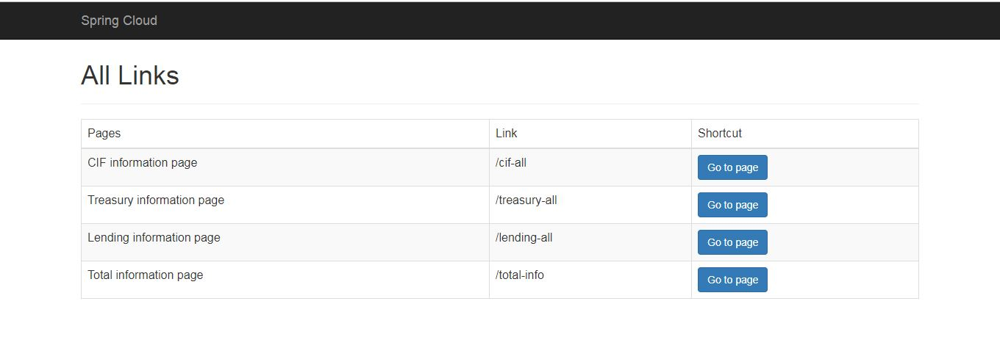
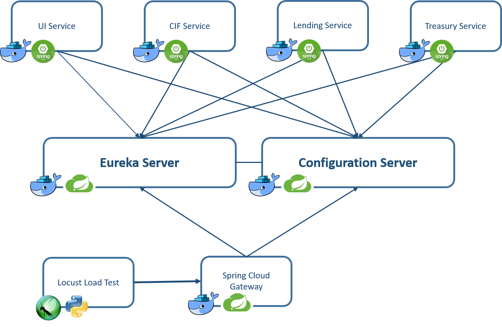
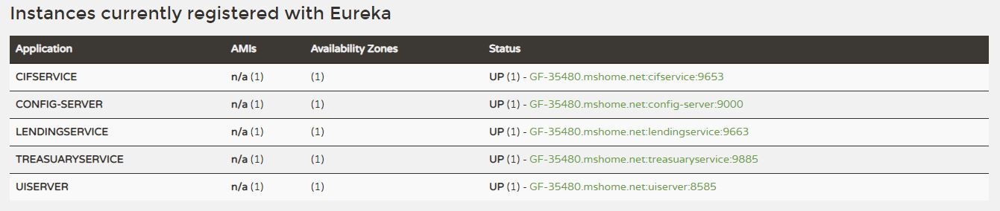
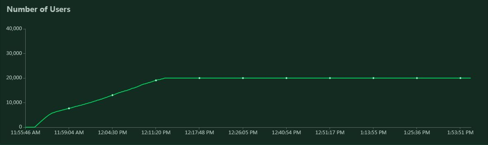
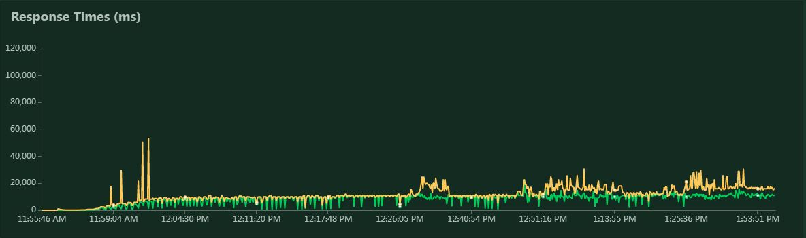
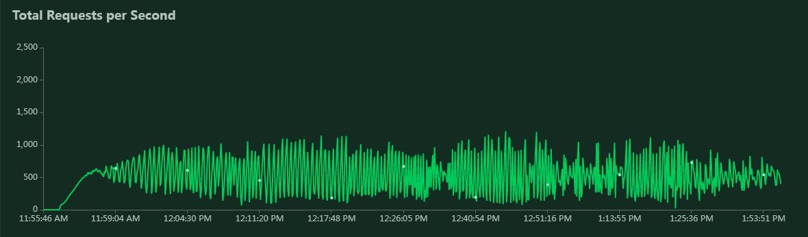
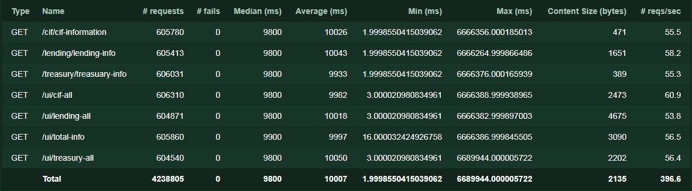

# Introduction
Microservice is a popular architecture in software engineer. this architecture
can implemented by any eminent framework in Java, like OSGi or Spring. In this 
project we want to implement Microservice by Spring Cloud.
This project contained forth microservice cif-service, lending-service, treasury-service
and ui-service. The module ui-service up on 8585 you will see as blow table:


 
 
 
 All available links listed on this table and you can switch into any pages by
 pressing button 'Go to page' on attribute row of table.
 
 
 
 
 
 ## Links
 * ```/cif-all``` : this page show all user data that registered in system.
 * ```/lending-all``` : this page show all lends that any user use them, announced by
 national identity of user.
 * ```/treasury-all``` : this page show reminded users money.
 * ```/total-info``` : this page contained data of three microservices CIF, LENDING an TREASURY. this 
 page designed for show benefit of using circuit break pattern that implemented by spring cloud. (I strongly suggest you
 that disable every microservice and discern it)
 
 # How to use
 ## Local
 For global config module you must copy all files in ```configfiles``` into your desired directory and change the
 ```config-server/src/main/resources/application.properties``` as follow:
 
 ```
 spring.cloud.config.server.git.uri=<your-desired-directory>
 ```
 
 initialize a git repository on this directory
 
 ```
 $ cd <your-desired-directory>
 $ git init
 $ git add --all
 $ git commit -m "initial commit"
 ```
 
 Run following modules (order is important):
 * eureka-server (it can be monitored via [http://localhost:8761](http://localhost:8761)) 
 * config-server 
 * cif-service, lending-service, treasury-service, ui-service
 
 Eureka come up on 8761 and you can see page as follow:
 
 
 
 ## Docker
 Docker container IP for eureka must be 172.18.0.16 and for config-server must be 172.18.0.2 . After creating 
 docker images these commands must be used.
 
 ```
 $ docker network create --subnet=172.18.0.0/16 my-network
 $ docker run -itd --name eureka-server --ip 172.18.0.16 -p 8761:8761 --net my-network eureka-server
 $ docker run -itd --name config-server --ip 172.18.0.2 -p 9000:9000 --net my-network config-server
 $ docker run -itd --name cif-service --net my-network cif-service
 $ docker run -itd --name kafka-consumer --net my-network kafka-consumer
 $ docker run -itd --name lending-service --net my-network lending-service
 $ docker run -itd --name treasury-service --net my-network treasury-service
 $ docker run -itd --name ui-server -p 8585:8585 --net my-network ui-server
 ```
 Install MySQL
 
 ```
 docker run --name=mysql --env="MYSQL_ROOT_PASSWORD=root" --net my-network mysql
 ```
 
 Now create tables and insert data into tables
 
 ```
 CREATE TABLE testdb.TBL_CIF (
   ID BIGINT AUTO_INCREMENT PRIMARY KEY,
   NI VARCHAR(10) NOT NULL,
   NAME VARCHAR(16) NOT NULL,
   FAMILY VARCHAR(30) NOT NULL
 );
 
 INSERT INTO testdb.TBL_CIF (NI, NAME, FAMILY) VALUES ('1111111111', 'JOHN', 'THOMAS');
 INSERT INTO testdb.TBL_CIF (NI, NAME, FAMILY) VALUES ('2222222222', 'JERY', 'TAMSON');
 INSERT INTO testdb.TBL_CIF (NI, NAME, FAMILY) VALUES ('3333333333', 'HENRY', 'GARY');
 INSERT INTO testdb.TBL_CIF (NI, NAME, FAMILY) VALUES ('4444444444', 'GOM', 'SILVER');
 INSERT INTO testdb.TBL_CIF (NI, NAME, FAMILY) VALUES ('5555555555', 'KIM', 'JONG OUN');
 INSERT INTO testdb.TBL_CIF (NI, NAME, FAMILY) VALUES ('6666666666', 'MARY', 'JEIMS');
 INSERT INTO testdb.TBL_CIF (NI, NAME, FAMILY) VALUES ('7777777777', 'HASAN', 'ABASI');
 INSERT INTO testdb.TBL_CIF (NI, NAME, FAMILY) VALUES ('8888888888', 'MOSI', 'THOMAS');
 
 CREATE TABLE testdb.TBL_LENDING (
   ID BIGINT AUTO_INCREMENT PRIMARY KEY,
   NI VARCHAR(10) NOT NULL,
   LENDING VARCHAR(255) NOT NULL
 );
 
 INSERT INTO testdb.TBL_LENDING (NI, LENDING) VALUES ('1111111111', '156,000,000');
 INSERT INTO testdb.TBL_LENDING (NI, LENDING) VALUES ('1111111111', '300,000,000');
 INSERT INTO testdb.TBL_LENDING (NI, LENDING) VALUES ('1111111111', '250,000,000');
 INSERT INTO testdb.TBL_LENDING (NI, LENDING) VALUES ('1111111111', '10,000,000');
 INSERT INTO testdb.TBL_LENDING (NI, LENDING) VALUES ('1111111111', '12,000,000');
 INSERT INTO testdb.TBL_LENDING (NI, LENDING) VALUES ('1111111111', '59,000,000');
 INSERT INTO testdb.TBL_LENDING (NI, LENDING) VALUES ('2222222222', '59,000,000');
 INSERT INTO testdb.TBL_LENDING (NI, LENDING) VALUES ('2222222222', '150,000,000');
 INSERT INTO testdb.TBL_LENDING (NI, LENDING) VALUES ('2222222222', '200,000,000');
 INSERT INTO testdb.TBL_LENDING (NI, LENDING) VALUES ('2222222222', '350,000,000');
 INSERT INTO testdb.TBL_LENDING (NI, LENDING) VALUES ('2222222222', '596,000,000');
 INSERT INTO testdb.TBL_LENDING (NI, LENDING) VALUES ('2222222222', '32,000,000');
 INSERT INTO testdb.TBL_LENDING (NI, LENDING) VALUES ('2222222222', '89,000,000');
 INSERT INTO testdb.TBL_LENDING (NI, LENDING) VALUES ('2222222222', '1,000,000');
 INSERT INTO testdb.TBL_LENDING (NI, LENDING) VALUES ('3333333333', '100,000,000');
 INSERT INTO testdb.TBL_LENDING (NI, LENDING) VALUES ('3333333333', '300,000,000');
 INSERT INTO testdb.TBL_LENDING (NI, LENDING) VALUES ('3333333333', '10,000,000');
 INSERT INTO testdb.TBL_LENDING (NI, LENDING) VALUES ('3333333333', '250,000,000');
 INSERT INTO testdb.TBL_LENDING (NI, LENDING) VALUES ('3333333333', '310,000,000');
 INSERT INTO testdb.TBL_LENDING (NI, LENDING) VALUES ('3333333333', '15,000,000');
 INSERT INTO testdb.TBL_LENDING (NI, LENDING) VALUES ('3333333333', '5,000,000');
 INSERT INTO testdb.TBL_LENDING (NI, LENDING) VALUES ('4444444444', '15,000,000');
 INSERT INTO testdb.TBL_LENDING (NI, LENDING) VALUES ('4444444444', '32,000,000');
 INSERT INTO testdb.TBL_LENDING (NI, LENDING) VALUES ('5555555555', '142,000,000');
 INSERT INTO testdb.TBL_LENDING (NI, LENDING) VALUES ('6666666666', '500,000,000');
 INSERT INTO testdb.TBL_LENDING (NI, LENDING) VALUES ('6666666666', '50,000,000');
 INSERT INTO testdb.TBL_LENDING (NI, LENDING) VALUES ('6666666666', '36,000,000');
 INSERT INTO testdb.TBL_LENDING (NI, LENDING) VALUES ('6666666666', '89,000,000');
 INSERT INTO testdb.TBL_LENDING (NI, LENDING) VALUES ('7777777777', '120,000,000');
 INSERT INTO testdb.TBL_LENDING (NI, LENDING) VALUES ('7777777777', '56,000,000');
 INSERT INTO testdb.TBL_LENDING (NI, LENDING) VALUES ('7777777777', '500,000');
 INSERT INTO testdb.TBL_LENDING (NI, LENDING) VALUES ('8888888888', '1,500,000');
 INSERT INTO testdb.TBL_LENDING (NI, LENDING) VALUES ('8888888888', '356,000,000');


 CREATE TABLE testdb.TBL_TREASUARY (
   ID BIGINT AUTO_INCREMENT PRIMARY KEY,
   NI VARCHAR(10) NOT NULL,
   MONEY VARCHAR(255) NOT NULL
 );
 
 INSERT INTO testdb.TBL_TREASUARY (NI, MONEY) VALUES ('1111111111', '12,000,000');
 INSERT INTO testdb.TBL_TREASUARY (NI, MONEY) VALUES ('2222222222', '32,000,000');
 INSERT INTO testdb.TBL_TREASUARY (NI, MONEY) VALUES ('3333333333', '56,000,000');
 INSERT INTO testdb.TBL_TREASUARY (NI, MONEY) VALUES ('4444444444', '105,000,000');
 INSERT INTO testdb.TBL_TREASUARY (NI, MONEY) VALUES ('5555555555', '78,000,000');
 INSERT INTO testdb.TBL_TREASUARY (NI, MONEY) VALUES ('6666666666', '59,000,000');
 INSERT INTO testdb.TBL_TREASUARY (NI, MONEY) VALUES ('7777777777', '74,000,000');
 INSERT INTO testdb.TBL_TREASUARY (NI, MONEY) VALUES ('8888888888', '1,569,000,000');
 
```
 
 # Load Test
 Locust load test has been used for loading test in this project. All requests send to gateway server module.
 load test simulation done with 20000 users number and 100 users hatching. 
 
 
 
 
 
 
 
 
 