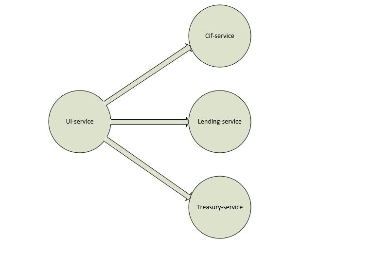

# Introduction
Microservice is a popular architecture in software engineer. this architecture
can implemented by any eminent framework in Java, like OSGi or Spring. In this 
project we want to implement Microservice by Spring Cloud.
This project contained forth microservice cif-service, lending-service, treasury-service
and ui-service. The module ui-service up on 8585 you will see as blow table:


 
 
 
 All available links listed on this table and you can switch into any pages by
 pressing button 'Go to page' on attribute row of table.
 
 
 
 
 
 ## Links
 * ```/cif-all``` : this page show all user data that registered in system.
 * ```/lending-all``` : this page show all lends that any user use them, announced by
 national identity of user.
 * ```/treasury-all``` : this page show reminded users money.
 * ```/total-info``` : this page contained data of three microservices CIF, LENDING an TREASURY. this 
 page designed for show benefit of using circuit break pattern that implemented by spring cloud. (I strongly suggest you
 that disable every microservice and discern it)
 
 # How to use
 ## Local
 For global config module you must copy all files in ```configfiles``` into your desired directory and change the
 ```config-server/src/main/resources/application.properties``` as follow:
 
 ```
 spring.cloud.config.server.git.uri=<your-desired-directory>
 ```
 
 initialize a git repository on this directory
 
 ```
 $ cd <your-desired-directory>
 $ git init
 $ git add --all
 $ git commit -m "initial commit"
 ```
 
 Run following modules (order is important):
 * eureka-server (it can be monitored via [http://localhost:8761](http://localhost:8761)) 
 * config-server 
 * cif-service, lending-service, treasury-service, ui-service
 
 Eureka come up on 8761 and you can see page as follow:
 
 
 
 ## Docker
 Docker container IP for eureka must be 172.18.0.16 and for config-server must be 172.18.0.1 . After creating 
 docker images these commands must be used.
 
 ```
 $ docker run -itd --name eureka-server --ip 172.18.0.16 eureka-server
 $ docker run -itd --name config-server --ip 172.18.0.1 config-server -p 8761:8761
 $ docker run -itd --name cif-service cif-service
 $ docker run -itd --name kafka-consumer kafka-consumer
 $ docker run -itd --name lending-service lending-service
 $ docker run -itd --name treasury-service treasury-service
 $ docker run -itd --name ui-server ui-server -p 8585:8585
 ```
 